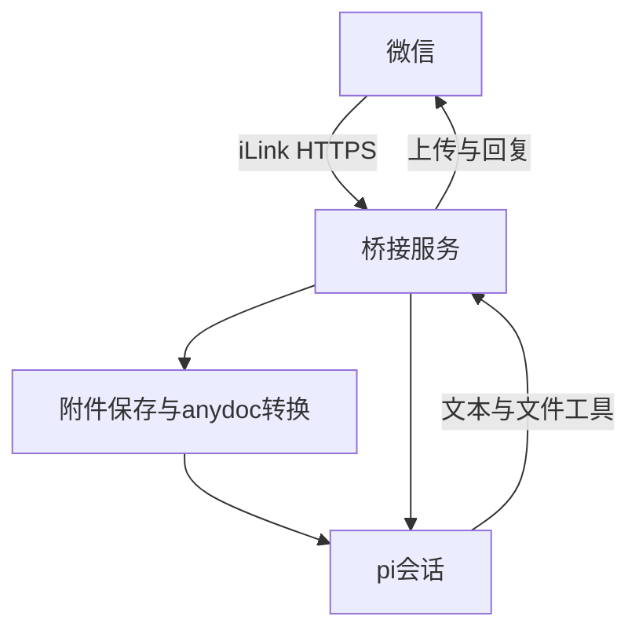

# pi-weixin-bridge

[](https://github.com/ReachForStar/pi-weixin-bridge/actions/workflows/ci.yml)
[](https://www.npmjs.com/package/pi-weixin-bridge)
[](https://opensource.org/licenses/MIT)
[](https://nodejs.org)

**中文** | [English](./README_en.md)

把 **pi**（编码 Agent）接入**微信 ClawBot** 的桥接服务。直连腾讯官方 **iLink 协议**，不依赖 OpenClaw，pi 通过 SDK 同进程接入。

在微信里给 ClawBot 发消息，即由 pi 处理并回复——把 pi 的全部能力（含 skills、工具）带到微信聊天界面。

## 架构



协议参考腾讯官方开源仓库 [`Tencent/openclaw-weixin`](https://github.com/Tencent/openclaw-weixin)（本服务剥离了其中的 OpenClaw 依赖，仅保留 iLink 客户端）。

## 前置条件

- 微信 App **8.0.70+**，且账号已开通 **ClawBot 插件**（设置 → 插件 → 微信ClawBot，官方灰度放量中）
- Node.js **22+**（pi-coding-agent SDK 及其内置 undici 要求 Node 22）
- 已安装并配置好 **pi**（本服务复用 `~/.pi/agent` 下的模型与鉴权配置）

## 安装与运行

### 一键安装（推荐，对标 openclaw-weixin-cli）

```bash
npm install -g pi-weixin-bridge
pi-weixin-bridge install
```

`install` 会依次：① 交互式选择保存路径（状态目录 / pi 工作目录，回车用默认，可 `install --yes` 跳过询问）→ ② 显示二维码供微信扫码绑定（已有账号则跳过）→ ③ 读取 pi models.json，选择供应方和默认模型 → ④ 启动后台 daemon → ⑤ 生成 Windows 隐藏窗口快捷方式。非交互安装必须已有有效默认模型，或通过 PI_WEIXIN_MODEL 指定，仍会在未登录时显示二维码。

路径选择说明：

- **状态目录**：账号凭据、会话上下文、后台日志的存放位置，默认 `~/.pi-weixin-bridge`；选择后写入 `~/.pi-weixin-bridge/config.json`，后续所有进程（含 daemon 子进程）自动生效
- **pi 工作目录**：Agent 读写文件的工作区，Windows 默认 `D:\pi_weixin_project`，Linux 默认 `~/pi-weixin-project`
- 安装时会**实际探针校验两个目录可写**；POSIX 下自动收紧权限（状态目录 `700`、账号文件 `600`，凭据不可被其他用户读取）

### CLI 命令

```bash
pi-weixin-bridge install     # 一键安装（扫码绑定 + 后台 daemon + 快捷方式）
pi-weixin-bridge login       # 扫码登录 / 重新绑定微信
pi-weixin-bridge config      # 配置路径、模型、访问权限、项目、文件上限和预算
pi-weixin-bridge start       # 前台运行桥接服务（默认）
pi-weixin-bridge stop        # 停止后台 daemon
pi-weixin-bridge status      # 查看后台 daemon 状态（pm2 list 风格表格：重启次数 / CPU / 内存 / 运行时长）
pi-weixin-bridge daemon      # daemon 管理：start/stop/status/restart/logs/install-boot/uninstall-boot
pi-weixin-bridge update      # 从 npm 更新最新版并重启后台
pi-weixin-bridge uninstall   # 卸载（停服务、删自启与快捷方式，保留账号）
pi-weixin-bridge help        # 帮助
```

### npm 更新与卸载

```bash
pi-weixin-bridge update
# 或停止后台后安装指定版本，再启动
pi-weixin-bridge daemon stop
npm install -g pi-weixin-bridge@版本号
pi-weixin-bridge daemon start

# 先移除后台服务、自启和快捷方式，再移除 npm 包
pi-weixin-bridge uninstall
npm uninstall -g pi-weixin-bridge
```

GitHub 保存源码和 CI，用户安装与升级统一使用 npm 上已发布的包。账号与本地配置在卸载后保留。更新前停止后台，npm 安装失败时保持停止并明确提示；重新安装成功后运行 daemon start。

### 后台 daemon 常驻部署（内置，默认推荐）

> 重要：后台进程无法扫码，须**先交互式登录一次**（`pi-weixin-bridge install` 选择模型并扫码，账号落盘），再启动 daemon。

```bash
# 1. 安装并选择模型（自动启动后台）
pi-weixin-bridge install

# 2. 启动后台 daemon（supervisor 常驻：崩溃自动重启、指数退避、日志轮转）
pi-weixin-bridge daemon start
pi-weixin-bridge daemon status    # 查看状态（pm2 list 风格表格）
pi-weixin-bridge daemon logs      # 查看日志（末尾 50 行）
pi-weixin-bridge daemon restart   # 重启
pi-weixin-bridge daemon stop      # 停止
```

内置 daemon 零第三方依赖，PID/日志落在 `~/.pi-weixin-bridge/daemon/`；后台重启和自启依赖 npm 包及 Node 路径存在，跨平台（Windows/POSIX）。

> **曾用 PM2 运行？** 1.6.0 起不再提供 PM2 配置。先 `pm2 stop pi-weixin-bridge` 停掉旧进程（避免两个实例同时轮询同一账号），再用 `pi-weixin-bridge daemon start` 启动。

**会话过期（errcode -14）重新扫码**：后台模式无法交互扫码，日志会提示：

```
[main] 后台模式无法扫码。请在终端运行 `pi-weixin-bridge login` 重新扫码，扫码完成后服务自动恢复
```

在任意终端跑 `pi-weixin-bridge login` 扫码即可，daemon 检测到账号更新后自动恢复，无需重启服务。

**开机自启（可选）**：

```bash
pi-weixin-bridge daemon install-boot     # 注册每用户登录计划任务（免管理员、隐藏窗口）
pi-weixin-bridge daemon uninstall-boot   # 移除
```

### 隐藏窗口启动（不弹终端框，PowerShell）

daemon 进程本身带 `windowsHide`，无控制台窗口；启动时弹出的终端框来自运行启动命令的窗口。用 PowerShell 隐藏启动可全程无可见窗口：

```powershell
# 1. 生成“双击无窗口”快捷方式（只需运行一次）
powershell -NoProfile -ExecutionPolicy Bypass -File create-shortcuts.ps1

# 2. 之后双击生成的快捷方式即可（无终端框）：
#    start-pi-weixin-bridge.lnk  → 后台启动（daemon start）
#    stop-pi-weixin-bridge.lnk   → 停止（daemon stop）
```

也可直接命令行隐藏启动：

```powershell
powershell -NoProfile -WindowStyle Hidden -ExecutionPolicy Bypass -File start-service.ps1
```

脚本说明：`start-service.ps1` / `stop-service.ps1` 以 `Start-Process -WindowStyle Hidden` 调用 `daemon start/stop`；`create-shortcuts.ps1` 生成以 `powershell -WindowStyle Hidden` 运行上述脚本的快捷方式（`.lnk` 为本机生成，已 gitignore）。

### Linux / WSL

本项目跨平台（Windows / Linux / macOS，daemon 杀进程树自动适配平台）。Linux 下同样支持后台 daemon 与会话过期重登（headless），无需扫码即可后台运行。

```bash
npm install -g pi-weixin-bridge
pi-weixin-bridge install       # 选择路径、扫码和模型，随后启动后台
```

- 安装向导在非 TTY（如 CI / SSH 无终端）下自动使用默认路径；交互终端则会询问状态目录与工作目录。
- 开机自启用 **systemd 用户服务**（免 root）：
  ```bash
  pi-weixin-bridge daemon install-boot     # 注册并 enable systemd user service
  pi-weixin-bridge daemon uninstall-boot   # 移除
  ```
  如需**未登录也随开机启动**，请管理员执行 `loginctl enable-linger <用户名>`。
- WSL 需启用 systemd（`wsl --update` + 发行版内 systemd 作为 PID 1），否则 `daemon install-boot` 会提示不可用，可手动 `daemon start`。
- 凭据文件在 Linux 下自动收紧为 `600`、状态目录 `700`。
- 注意：WSL 与 Windows 的 `~` 不同，两端账号/状态相互独立，互不干扰。

## 配置

配置解析优先级：**环境变量 > `~/.pi-weixin-bridge/config.json`（install / config 写入）> 平台默认**。

运行 `pi-weixin-bridge config` 交互式选择配置项；`config model` 单独选择 models.json 中的供应方和默认模型。配置不重新扫码、不自动启动后台，不改变已有会话通过 `/model` 选择的模型。

```bash
pi-weixin-bridge config help
pi-weixin-bridge config show
pi-weixin-bridge config models
pi-weixin-bridge config model 1
pi-weixin-bridge config get model
pi-weixin-bridge config set budget.dailyTokens 100000
pi-weixin-bridge config set budget.timeZone Asia/Shanghai
pi-weixin-bridge config set maxFileBytes 20971520
pi-weixin-bridge config unset budget.dailyTokens
```

模型编号对应当次 `config models` 列表，也可传入完整供应方/模型引用。`config set <配置项> <值>` 与 `config unset <配置项>` 支持 `model`、`stateDir`、`workspace`、`access`、`access.admins`、`access.allowFrom`、`access.permission`、`budget`、`budget.dailyTokens`、`budget.dailyCost`、`budget.timeZone`、`maxFileBytes`、`projects`。数组和对象使用 JSON；建议在交互式 config 中输入 JSON，避免终端参数引号差异。

配置保存前校验模型目录、权限、正数预算、时区、文件上限与项目结构，失败不改写原配置。修改嵌套项保留其他字段；`unset access.admins` 或 `unset access.allowFrom` 保留空列表，`unset access` 会恢复所有联系人完整权限，设置访问限制时必须配置管理员编号。

保存后执行 `pi-weixin-bridge daemon restart`。修改状态目录或默认工作目录前必须 `daemon stop`；状态目录变更不会自动迁移旧账号、会话或任务，新目录需已有账号或重新登录，改路径后须重新注册自启。环境变量仍优先，可通过 `config show` 查看覆盖。从 1.6.1 升级后若提示未选择默认模型，运行 `config model`，再 `daemon start`。

| 变量 | 默认 | 说明 |
|---|---|---|
| `PI_WEIXIN_MODEL` | 安装时选择 | 默认模型引用，优先于 config.json |
| `PI_CODING_AGENT_DIR` | `~/.pi/agent` | pi models.json 与鉴权配置目录 |
| `PI_WEIXIN_STATE_DIR` | `~/.pi-weixin-bridge` | 状态目录（账号凭据、会话上下文、daemon 日志） |
| `PI_WEIXIN_WORKSPACE` | Windows `D:\pi_weixin_project` / 其他 `~/pi-weixin-project` | pi 会话的工作目录（Agent 在此读写文件） |

`config.json` 示例（由 `install` / `config` 生成，可手改）：

```json
{ "stateDir": "D:\\data\\piwx", "workspace": "D:\\pi_weixin_project" }
```

权限：POSIX 下状态目录与账号凭据文件会自动收紧为 `700` / `600`；Windows 依赖用户目录 ACL（默认即仅当前用户可访问）。

## 项目结构

```
src/
├── index.ts          # 入口：登录、状态持久化、会话超时/鉴权失效重登、优雅退出
├── cli.ts            # CLI 命令（install/login/start/stop/status/update/uninstall/help）
├── account.ts        # 账号凭据读写
├── config.ts         # 协议常量与路径配置
├── bridge.ts         # 主循环：getUpdates → 媒体 → pi → sendMessage，typing 状态
├── daemon/           # 内置后台 daemon（零第三方依赖，替代 PM2）
│   ├── daemon.ts     # 控制端：拉起/停止 supervisor 进程树、PID 与日志、退避策略
│   ├── supervisor.ts # supervisor 进程：子进程崩溃自动重启（指数退避）
│   └── boot.ts       # 开机自启：注册/移除每用户登录计划任务（免管理员）
├── logger/           # 分级日志（info/warn/error/debug + 时间戳）
├── ilink/
│   ├── types.ts      # iLink 协议类型与枚举
│   ├── client.ts     # HTTP 客户端（请求头、长轮询、收发、typed errors）
│   ├── errors.ts     # 错误类型（Network/Auth/Protocol/SessionTimeout）
│   ├── login.ts      # 扫码登录流程（含重定向、配对码、过期刷新）
│   ├── context-store.ts # context_token / typing ticket 持久化
│   ├── message.ts    # 消息正文提取（文本 / 语音转文字）
│   └── media.ts      # 媒体：AES 加解密、CDN 上传下载、入站解析、出站媒体上传
├── message/          # 消息构造 / 解析
│   ├── parser.ts     # 入站消息解析
│   ├── builder.ts    # 出站消息构造（文本/图片/文件/视频）
│   └── markdown.ts   # markdown 格式化 / 转义 / 分块
└── pi/
    └── sessions.ts   # pi 会话管理（按微信会话隔离 + 串行化 + 发图工具 + skill/MCP 一次性指令）
examples/             # 示例（echo-bot 最小回声机器人）
test/                 # 单元测试（vitest）
```

最小示例见 [examples/echo-bot.ts](examples/echo-bot.ts)。

## iLink 协议要点

- **基地址**：`https://ilinkai.weixin.qq.com`（登录后可能因 IDC 调度切换）
- **请求头**：`AuthorizationType: ilink_bot_token`、`Authorization: Bearer <bot_token>`、`X-WECHAT-UIN`、`iLink-App-Id: bot` 等
- **核心接口**：`get_bot_qrcode` / `get_qrcode_status`（登录）、`getupdates`（长轮询收消息）、`sendmessage`（发消息）、`getconfig` / `sendtyping`（输入状态）、`getuploadurl`（媒体上传）
- **关键机制**：回复须原样带回入站消息的 `context_token`；`getupdates` 用 `get_updates_buf` 做增量同步；`errcode -14` 表示会话超时需重登
- **媒体**：CDN 域名 `https://novac2c.cdn.weixin.qq.com/c2c`，AES-128-ECB 加解密；入站图片解密后转 base64 供 pi 视觉理解，出站图片经 `send_weixin_image` 工具上传发送

## 功能范围

- ✅ 扫码登录 + 凭据持久化 + 会话超时自动重登
- ✅ 文本消息收发（私聊 / 群聊 @）
- ✅ 按微信会话隔离的 pi 多会话 + 串行化
- ✅ 对话自动保存，服务重启后继续上下文；`/new` 开始新的持久对话
- ✅ 任务开始确认、长任务每 30 秒进度、失败与停止通知
- ✅ 「正在输入」状态提示（getconfig + sendtyping）
- ✅ 入站媒体：图片（解密→pi 视觉）、语音（服务端转文字）、文件/视频（解密落盘→告知路径）
- ✅ 入站文档：anydoc 0.2.4 自动将 PDF、Word、PowerPoint、Excel、OpenDocument、RTF、EPUB、CSV 转为 Markdown 后交给 pi
- ✅ 出站媒体：图片/文件/视频经 CDN 上传后发送（`send_weixin_image` 工具 + builder）
- ✅ 长文本分块发送（markdown 分块，避免超出微信单条长度）
- ✅ 分级日志 + 错误分类（网络/鉴权/协议）+ 鉴权失效自动重登
- ✅ context_token / typing ticket 持久化（重启恢复）
- ✅ 斜杠命令（基本命令：`/help` / `/status` / `/new` / `/model` / `/skill` / `/mcp` / `/reload` / `/usage` / `/stop` / `/ping`），未知命令交由 pi
- ✅ 内置后台 daemon（崩溃自动重启 + 日志轮转 + 开机自启，零第三方依赖；Windows 计划任务 / Linux systemd 用户服务）
- ✅ 跨平台（Windows / Linux / macOS），安装向导交互式选择保存路径 + 凭据权限加固（POSIX 700/600）
- ⬜ 出站语音（需 silk 编码，未做）

### 对话恢复与任务通知

对话保存在状态目录的 `sessions/` 下，按账号、工作目录和微信对话隔离。重启后收到下一条普通消息时恢复当前对话；`/new` 切换到空白对话并保存选择，旧记录保留。保存的是对话内容，不会自动重做重启前未完成的任务；升级前仅保存在内存中的历史无法恢复。

任务开始时发送确认，长任务每 30 秒报告处理阶段、耗时和已结束的工具调用次数，普通回复作为完成结果。任务失败或停止会提示；通知不包含工具参数和原始错误，详细原因写入服务日志。会话文件可能包含用户消息、图片和工具结果，请限制状态目录访问权限。通知发送失败单独记录，不中断 Agent 任务。

### 附件自动处理

发送 PDF、Word、Excel、PowerPoint 等受支持文档时，桥接服务先保存原件，再使用内置的 anydoc 0.2.4 本地转换为 Markdown，将原件和 Markdown 路径交给 pi。支持格式以 anydoc 的内容识别和扩展名识别结果为准；Markdown、普通文本与其他文件保留现有路径处理方式。转换结果保存在原件旁边（`原文件路径.md`），不会覆盖原件；长时间转换会在任务进度中显示。转换每个文件最多运行 120 秒，子进程控制输出上限为 16 MiB。

扫描型 PDF 会明确提示需要 OCR，原件保留，默认不上传外部服务；若要使用 Firecrawl 云端 OCR，须另行确认上传。损坏或加密文档转换失败时通知用户，不把失败文件当作已转换文档交给 pi。

### 模型

安装扫码后自动读取 pi 的 `models.json` 中实际配置的供应方，按供应方编号和模型编号选择，保存默认值到 `~/.pi-weixin-bridge/config.json`。不预设供应方。`PI_CODING_AGENT_DIR` 可指定 pi 配置目录，鉴权沿用 pi；缺失配置或默认模型时明确报错。

微信 `/model` 查看当前会话模型，`/model list` 列出供应方、模型及编号，`/model <编号或供应方/模型>` 仅切换当前会话，选择持久化，其他会话与安装默认值保持原选择。`/reload` 更新配置并保留各会话选择；环境变量 `PI_WEIXIN_MODEL` 指定安装默认模型。

### 斜杠命令

| 命令 | 说明 |
|---|---|
| `/help` | 显示帮助 |
| `/status` | 服务状态（版本 / 账号 / 模型 / 工作目录 / 运行时长 / 会话） |
| `/new` | 开始新对话（清空当前会话上下文） |
| `/model` | 查看当前模型 |
| `/model list` | 可用模型列表（只列 models.json 注册的 provider） |
| `/model <provider/modelId>` | 仅切换当前会话模型，保存到会话偏好（也可输入列表编号） |
| `/skill` | 可用 skill 列表（含说明） |
| `/skill <名称>` | 下一条消息按该 skill 处理（pi 会先读其 SKILL.md 再执行） |
| `/mcp` | 已配置 MCP server 列表（含启动命令） |
| `/mcp <名称>` | 下一条消息调用该 server 的工具处理 |
| `/reload` | 重载模型配置（models.json 改动立即生效，并重新应用到现有会话） |
| `/usage` | 当前对话用量（消息 / 工具调用 / Token / 成本 / 上下文占用；模型服务未返回 usage 时 Token/成本为 0 并提示） |
| `/stop` | 停止当前对话的任务和等待中的消息，包含附件下载、格式转换与模型处理 |
| `/tasks` | 查看当前对话的任务编号、处理状态、耗时和消息摘要 |
| `/cancel <任务编号>` | 单独取消指定任务，其余消息继续；编号来自 `/tasks` |
| `/ping` | 服务存活检查 |

> 命令回复统一用 markdown 列表格式（微信端按 markdown 渲染；单换行会被折成空格，列表项才是硬换行）。


### 文件、会话与资料

模型可调用 `send_weixin_file` 把当前项目内的报告、PDF、Word、Excel 等实际文件发回当前对话；默认单文件上限 20 MiB，可通过 `maxFileBytes` 调整。发送前检查真实路径，拒绝目录和越出项目的路径。

- `/sessions` 查看当前项目历史；`/resume <编号>` 切换；`/rename <名称>` 命名；`/export` 导出并发送 HTML。
- `/files` 查看保存的资料；`/files find <关键词>` 本地检索；`/file <编号>` 取回原件；`/file <编号> markdown` 取回转换结果。
- 资料按当前微信对话保存，内容 SHA-256 去重；原件位于接收时的项目 `.weixin-files/`，索引位于状态目录 `documents/`。切换项目后，文件取回仍要求当前项目包含该文件，必要时先切回原项目。
- 本地全文检索最多加载最近 200 份资料，每份文本不超过 2 MiB，返回最多 8 个片段与来源。模型也可用 `search_weixin_files` 检索。
- 扫描 PDF 使用 `/ocr <文件编号>`，机器人展示上传 Firecrawl 的文件与费用提示后，用户再发 `/approve <确认编号>` 才会执行。仅此次文件获授权；`/reject <编号>` 拒绝，120 秒未确认则取消。
- anydoc 支持的办公文档内嵌图片会另存为资产；PDF 内嵌图片不通过不受支持的 `toDocument` 提取。转换每文件超时 120 秒；子进程控制输出上限 16 MiB，Markdown 文件本身由磁盘容量限制。

### 权限与项目

配置文件可加入以下字段，示例中的微信用户标识和工作目录需要替换为实际值：

```json
{
  "access": {
    "admins": ["你的微信用户标识"],
    "allowFrom": ["只读用户标识"],
    "permission": "guarded"
  },
  "projects": {
    "reports": {
      "workspace": "D:\\reports",
      "permission": "guarded",
      "tools": ["read", "grep", "find", "ls", "write", "edit", "send_weixin_file", "search_weixin_files"]
    }
  },
  "maxFileBytes": 20971520,
  "budget": { "dailyTokens": 100000, "dailyCost": 5, "timeZone": "Asia/Shanghai" }
}
```

未配置 `access` 时保持个人使用方式，能发消息的用户具有完整权限；配置后只接收管理员及白名单消息，普通白名单用户为只读。管理员的 `guarded` 模式在工具执行前展示完整参数，写入、命令执行与文件发送等待编号确认；参数超过展示上限则拒绝操作。`full` 允许完整工具执行，`read-only` 仅允许读取、查找和资料检索，并禁用用户扩展和技能。

`/project` 查看项目，`/project reports` 切换。项目支持 `model`、`tools` 与 `skills` 名单，模型使用实际 `供应方/模型编号`。会话模型选择优先于项目模型，再使用安装默认模型；切换项目清除之前的模型覆盖。工作目录与工具限制不构成操作系统沙箱，完整权限的命令及用户扩展仍需可信。

### 任务历史、定时与预算

`/history` 查看持久任务记录，`/result <编号>` 查看最后保存的文本回复或错误。相同消息编号不会重复提交模型；重启时把未结束的任务标记为中断。`/retry <编号>` 需要再次确认，使用原指令与已保存的附件重新处理，不回滚之前的修改；未完成下载的附件需要重发。`/tasks` 和 `/cancel` 使用当前队列编号，`/history` 使用持久记录编号，两者用途不同。

```text
/schedule add {"prompt":"检查工作目录并汇报","cron":"0 9 * * *","timeZone":"Asia/Shanghai"}
/schedule add {"prompt":"汇总今日资料","at":"2026-10-01T09:00:00+08:00","timeZone":"Asia/Shanghai"}
/schedule
/schedule pause <编号>
/schedule resume <编号>
/schedule delete <编号>
```

单次日期必须在未来且带时区，周期由 cron-parser 解析。仅管理员可创建和管理。服务需要持续运行及有效微信上下文才能执行、投递；重启不补做正在执行的任务，失败或中断会暂停并保留原因。定时任务使用独立会话，不自动引入普通对话的附件；原项目选择发生变化时暂停。`guarded` 项目的定时执行使用只读工具，`full` 项目保留完整权限；当前定时任务只投递文本，普通对话支持文件回传。

`/daily` 按配置时区报告今日已返回用量，`budget` 达标后拒绝后续请求；未返回 usage 的请求明确记为未知，已报告的部分仍累计。预算无法保证单次任务不超额。`/doctor` 只读检查本地目录、模型配置与权限，不发送模型请求，不输出凭据。

状态目录新增 `preferences/`、`documents/`、`tasks/`、`usage/` 和 `schedules.json`；记录不保存附件解密参数或微信上下文令牌。微信上下文独立存于 `contexts/`，按账号隔离；旧 `context.json` 不跨账号迁移，升级后向机器人发一条消息以刷新上下文。历史、结果、文件可能含私密内容，不自动清理，请维护目录访问权限。

## ⚠️ 安全提示

pi 是具备工具执行能力的编码 Agent（默认含 bash 等工具）。接入微信后，**任何能给该 ClawBot 发消息的人，都可能通过对话让 pi 在你的机器上执行命令**。请务必：

- 仅在私聊中使用，不要将 ClawBot 拉入不可信的群聊
- 通过 `PI_WEIXIN_WORKSPACE` 限定 pi 的工作目录，降低误操作影响面
- 使用 config.json 的 access 白名单、管理员与项目 tools/skills 限制；选择 guarded 要求操作确认

## 开发

```bash
npm run typecheck   # 类型检查
npm test            # 单元测试（vitest）
npm run build       # 构建到 dist/
```

CI：GitHub Actions 在 push / PR 时自动跑 typecheck + test + build（Node 22）。推送到 `main` 后比较推送前后的 `package.json` 版本号，仅版本变化且检查通过时发布 npm 并创建 GitHub Release；版本不变和 PR 均不发布。发布前由维护者确认版本号、CHANGELOG 和验证结果，再修改版本并推送；CI 不另设审批步骤。npm 已发布的版本跳过上传，仍可补建缺失的 Release。

后台 `status` 区分初始化、等待扫码、消息循环已启动与重启中。前台和后台桥接共享独占实例锁，重复启动拒绝；PID 文件损坏时明确报错。停止等待子进程结束，失败保留 PID 信息。Windows 自启使用绝对 PowerShell 路径，隐藏启动脚本等待启动结果并传播退出码；Linux unit 保存自定义路径并配置 ExecStop。实际系统注册需要在使用机器上执行。

## 故障排查

| 现象 | 原因 / 解决 |
|---|---|
| 启动弹 node.exe 控制台框 | 用内置 daemon（已默认）；勿用 tsx CLI 直接拉起（会额外派生无 `windowsHide` 的子进程） |
| 后台会话过期，收不到消息 | 后台模式无法扫码，日志提示运行 `pi-weixin-bridge login` 重新扫码，扫码后服务自动恢复 |
| 自定义的保存路径不生效 | 路径写入 `~/.pi-weixin-bridge/config.json`（安装向导生成）；运行时环境变量 `PI_WEIXIN_STATE_DIR`/`PI_WEIXIN_WORKSPACE` 优先于 config.json。改完需 `daemon restart` |
| Linux `daemon install-boot` 提示 systemd 不可用 | WSL 未启用 systemd（需 `wsl --update` 且 systemd 为 PID 1）；可手动 `daemon start` 后台运行 |
| 状态目录 / 凭据权限 | POSIX 下状态目录自动 `700`、账号文件 `600`；若目录属主不是当前用户则 chmod 会静默跳过，请检查目录归属 |
| 发图片但 pi 说“看不到图” | pi 全局 `images.blockImages` 为 true 会在送入模型前剥离图片；改为 false（`~/.pi/agent/settings.json`） |
| 提示会话过期 / 要求重扫 | errcode -14，运行 `pi-weixin-bridge login` 重新扫码 |
| 消息被重复处理 / 冲突 | 同一微信账号勿多实例同时轮询 getUpdates；确保只有一个服务在跑 |
| `/usage` 的 Token/成本显示 0 | 模型服务未返回 usage（部分 OpenAI 兼容代理/自建 vllm 不支持 stream usage），服务端行为非统计故障；上下文占用为本地估算不受影响 |
| 微信发文件收不到 / 日志出现 terminated | CDN 下载瞬断，1.5.3+ 自动重试（3 次递增退避、120s 超时）；仍失败则重发文件 |
| npm 安装超时 | 检查 npm registry 配置及网络连接后重试 |

## 许可

[MIT](./LICENSE)。本项目的 iLink 协议客户端（`src/ilink/`）衍生自腾讯开源的 [`Tencent/openclaw-weixin`](https://github.com/Tencent/openclaw-weixin)（MIT 许可，Copyright Tencent），完整归属与原始许可证见 [NOTICE](./NOTICE)。
