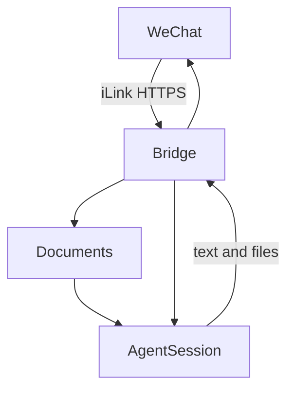

# pi-weixin-bridge

[](https://github.com/ReachForStar/pi-weixin-bridge/actions/workflows/ci.yml)
[](https://www.npmjs.com/package/pi-weixin-bridge)
[](https://opensource.org/licenses/MIT)
[](https://nodejs.org)

**[中文](./README.md)** | English

A bridge service that connects **pi** (a coding agent) to **WeChat ClawBot**. It talks directly to Tencent's official **iLink protocol** — no OpenClaw dependency — with pi integrated in-process via its SDK.

Message ClawBot in WeChat and pi handles it and replies — bringing pi's full capabilities (skills, tools) into the WeChat chat interface.

## Architecture



The protocol is based on Tencent's official open-source repo [`Tencent/openclaw-weixin`](https://github.com/Tencent/openclaw-weixin) (this service strips out the OpenClaw dependency and keeps only the iLink client).

## Prerequisites

- WeChat app **8.0.70+**, with the **ClawBot plugin** enabled on your account (Settings → Plugins → WeChat ClawBot; official gradual rollout)
- Node.js **22+** (the pi-coding-agent SDK and its bundled undici require Node 22)
- **pi** installed and configured (this service reuses the model & auth config under `~/.pi/agent`)

## Install & Run

### One-line install (recommended, mirrors openclaw-weixin-cli)

```bash
npm install -g pi-weixin-bridge
pi-weixin-bridge install
```

`install` will: ① interactively choose save paths (state dir / pi workspace; Enter for defaults, or `install --yes` to skip prompts) → ② show a QR code for WeChat binding (skipped if an account already exists) → ③ select a provider and default model from models.json → ④ start the daemon → ⑤ create Windows shortcuts. Non-interactive installation needs an existing default or PI_WEIXIN_MODEL; QR login is still required when no account is saved.

Path selection notes:

- **State directory**: where account credentials, session context and daemon logs live; defaults to `~/.pi-weixin-bridge`. Your choice is written to `~/.pi-weixin-bridge/config.json` and picked up automatically by every process (including daemon children)
- **pi workspace**: defaults to `~/pi-weixin-project` for fresh installations; existing Windows configurations retain their old directory when it exists
- Both directories are **probe-tested for writability** before installation; on POSIX the state dir is tightened to `700` and the account file to `600` (credentials unreadable by other users)

### CLI commands

```bash
pi-weixin-bridge install     # one-line install (QR bind + background daemon + shortcuts)
pi-weixin-bridge login       # QR login / re-bind WeChat
pi-weixin-bridge config      # Configure paths, model, access, projects, file limits and budgets
pi-weixin-bridge start       # run the bridge in the foreground (default)
pi-weixin-bridge stop        # stop the background daemon
pi-weixin-bridge status      # show background daemon status (pm2 list style table: restarts / CPU / memory / uptime)
pi-weixin-bridge daemon      # daemon management: start/stop/status/restart/logs/install-boot/uninstall-boot
pi-weixin-bridge update      # update from npm and restart the daemon
pi-weixin-bridge uninstall   # uninstall (stop service, remove boot task & shortcuts, keep account)
pi-weixin-bridge help        # help
```

### npm updates and removal

```bash
pi-weixin-bridge update
pi-weixin-bridge uninstall
npm uninstall -g pi-weixin-bridge
```

GitHub hosts source and CI. Install released packages from npm. Updates stop the daemon before replacing the package; failed installs leave it stopped. Account and local settings remain after removal.

### Background daemon deployment (built-in, recommended)

> Important: a background process cannot scan a QR code, so you must **log in interactively once first** (`pi-weixin-bridge install`, scan and select a model), then start the daemon.

```bash
# 1. Install, scan and select the default model
pi-weixin-bridge install

# 2. Start the background daemon (a supervisor keeps it alive: auto-restart on crash, exponential backoff, log rotation)
pi-weixin-bridge daemon start
pi-weixin-bridge daemon status    # show status (pm2 list style table)
pi-weixin-bridge daemon logs      # view logs (last 50 lines)
pi-weixin-bridge daemon restart   # restart
pi-weixin-bridge daemon stop      # stop
```

The built-in daemon has zero third-party dependencies, and PID/logs live in `~/.pi-weixin-bridge/daemon/` (restart and boot require the npm package and Node paths to exist), cross-platform (Windows/POSIX).

> **Previously running under PM2?** PM2 configuration is no longer shipped as of 1.6.0. First stop the old process with `pm2 stop pi-weixin-bridge` (to avoid two instances polling the same account), then start with `pi-weixin-bridge daemon start`.

**Session expiry (errcode -14) and re-scanning**: a background process cannot scan interactively, so the log will tell you to:

```
[main] Cannot scan QR in background mode. Run `pi-weixin-bridge login` in a terminal to re-scan; the service resumes automatically once scanning completes.
```

Just run `pi-weixin-bridge login` in any terminal and scan; the daemon detects the new account and resumes automatically — no service restart needed.

**Start on boot (optional)**:

```bash
pi-weixin-bridge daemon install-boot     # register a per-user logon scheduled task (no admin, hidden window)
pi-weixin-bridge daemon uninstall-boot   # remove it
```

### Hidden-window startup (no console popup, PowerShell)

The daemon process carries `windowsHide`, so it has no console window of its own; the console you see at startup comes from the window that runs the start command. Starting hidden via PowerShell keeps everything invisible:

```powershell
# 1. Generate "double-click, no window" shortcuts (run once)
powershell -NoProfile -ExecutionPolicy Bypass -File create-shortcuts.ps1

# 2. Then just double-click the generated shortcuts (no console):
#    start-pi-weixin-bridge.lnk  → start in background (daemon start)
#    stop-pi-weixin-bridge.lnk   → stop (daemon stop)
```

You can also start hidden from the command line directly:

```powershell
powershell -NoProfile -WindowStyle Hidden -ExecutionPolicy Bypass -File start-service.ps1
```

Script notes: `start-service.ps1` / `stop-service.ps1` call `daemon start/stop` via `Start-Process -WindowStyle Hidden`; `create-shortcuts.ps1` generates shortcuts that run those scripts with `powershell -WindowStyle Hidden` (the `.lnk` files are generated locally and gitignored).

### Linux / WSL

This project is cross-platform (Windows / Linux / macOS; the daemon's process-tree kill adapts per platform). Linux supports the same background daemon and headless re-login flow.

```bash
npm install -g pi-weixin-bridge
pi-weixin-bridge install
```

- The install wizard automatically uses default paths in non-TTY environments (CI / SSH without a terminal); in an interactive terminal it prompts for the state dir and workspace.
- Start on boot uses a **systemd user service** (no root required):
  ```bash
  pi-weixin-bridge daemon install-boot     # register & enable the systemd user service
  pi-weixin-bridge daemon uninstall-boot   # remove it
  ```
  To start on boot **without a login session**, an admin must run `loginctl enable-linger <username>`.
- WSL requires systemd enabled (`wsl --update` + systemd as PID 1 in the distro); otherwise `daemon install-boot` reports it unavailable — use `daemon start` manually.
- On Linux the credentials file is tightened to `600` and the state dir to `700` automatically.
- Note: WSL and Windows have different `~`, so the two sides keep independent accounts/state.

## Platform support

Windows, macOS and Linux use Node.js 22+ and global npm installation. Windows uses built-in Windows PowerShell 5.1 and supports package paths with spaces; pwsh is not required. macOS login startup uses a per-user LaunchAgent and system plutil; stop the existing daemon before daemon install-boot. The agent runs the supervisor directly and can be removed with daemon uninstall-boot. Linux startup requires an available systemd user session; daemon start itself also works without systemd.

Fresh installs use ~/pi-weixin-project. Existing Windows configurations retain D:\pi_weixin_project when that directory exists. Explicit paths and environment variables retain priority. Register startup again after changing Node, package or configuration paths. CI checks Windows, macOS and Linux before permitting a release.

## Configuration

Resolution priority: **environment variables > `~/.pi-weixin-bridge/config.json` (written by install / config) > platform defaults**.

Run `pi-weixin-bridge config` to choose a setting interactively, or `config model` to select a provider and default model from pi models.json. Configuration does not log in again or start the daemon automatically, and does not replace existing per-conversation model selections.

```bash
pi-weixin-bridge config help
pi-weixin-bridge config show
pi-weixin-bridge config models
pi-weixin-bridge config model 1
pi-weixin-bridge config get model
pi-weixin-bridge config set budget.dailyTokens 100000
pi-weixin-bridge config set budget.timeZone Asia/Shanghai
pi-weixin-bridge config set maxFileBytes 20971520
pi-weixin-bridge config unset budget.dailyTokens
```

Model numbers refer to the current `config models` list; full provider/model references are also accepted. `config set <key> <value>` and `config unset <key>` support model, stateDir, workspace, access, access.admins, access.allowFrom, access.permission, budget, budget.dailyTokens, budget.dailyCost, budget.timeZone, maxFileBytes, and projects. Use JSON for arrays and objects; interactive input avoids shell quoting differences. Invalid settings leave the saved configuration unchanged. Nested changes preserve sibling fields. Clearing admins or allowFrom keeps an empty list; removing access entirely restores full permissions for every contact.

Restart the daemon after saving. Stop it before changing stateDir or workspace; existing credentials, sessions and tasks are not migrated. A new state directory needs an existing account or a new login. Register startup again after changing paths. `config show` displays saved settings and active environment overrides without provider secrets. When upgrading from 1.6.1 without a saved default model, run `config model` and then `daemon start`.

| Variable | Default | Description |
|---|---|---|
| `PI_WEIXIN_STATE_DIR` | `~/.pi-weixin-bridge` | State directory (account credentials, session context, daemon logs) |
| `PI_WEIXIN_WORKSPACE` | `~/pi-weixin-project` for fresh installs; existing Windows paths preserved | Working directory for pi sessions (the agent reads/writes files here) |

`config.json` example (generated by `install`, editable by hand):

```json
{ "stateDir": "D:\\data\\piwx", "workspace": "D:\\pi_weixin_project" }
```

Permissions: on POSIX the state dir and account file are tightened to `700` / `600`; on Windows the user-home ACL applies (current user only by default).

## Project structure

```
src/
├── index.ts          # entry: login, state persistence, session-timeout re-login, graceful shutdown
├── cli.ts            # CLI commands (install/login/start/stop/status/daemon/update/uninstall/help)
├── account.ts        # account credential read/write
├── config.ts         # protocol constants & path config
├── bridge.ts         # main loop: getUpdates → media → pi → sendMessage, typing status
├── daemon/           # built-in background daemon (zero third-party deps, replaces PM2)
│   ├── daemon.ts     # control side: start/stop the supervisor process tree, PID & logs, backoff policy
│   ├── supervisor.ts # supervisor process: auto-restart the child on crash (exponential backoff)
│   └── boot.ts       # start-on-boot: register/remove per-user logon scheduled task (no admin)
├── logger/           # leveled logging (info/warn/error/debug + timestamps)
├── ilink/
│   ├── types.ts      # iLink protocol types & enums
│   ├── client.ts     # HTTP client (headers, long-poll, send/receive, getconfig/sendtyping/getuploadurl)
│   ├── errors.ts     # error types (Network/Auth/Protocol/SessionTimeout)
│   ├── login.ts      # QR login flow (redirect, pairing code, expiry refresh)
│   ├── context-store.ts # context_token / typing ticket persistence
│   ├── message.ts    # message body extraction (text / voice-to-text)
│   └── media.ts      # media: AES encrypt/decrypt, CDN upload/download, inbound parsing, outbound media upload
├── message/          # message building / parsing
│   ├── parser.ts     # inbound message parsing
│   ├── builder.ts    # outbound message building (text/image/file/video)
│   └── markdown.ts   # markdown formatting / escaping / chunking
└── pi/
    └── sessions.ts   # pi session management (per-WeChat-chat isolation + serialization + image-send tool)
examples/             # examples (echo-bot)
test/                 # unit tests (vitest)
```

Minimal example: [examples/echo-bot.ts](examples/echo-bot.ts).

## iLink protocol essentials

- **Base URL**: `https://ilinkai.weixin.qq.com` (may switch after login due to IDC scheduling)
- **Headers**: `AuthorizationType: ilink_bot_token`, `Authorization: Bearer <bot_token>`, `X-WECHAT-UIN`, `iLink-App-Id: bot`, etc.
- **Core endpoints**: `get_bot_qrcode` / `get_qrcode_status` (login), `getupdates` (long-poll receive), `sendmessage` (send), `getconfig` / `sendtyping` (typing status), `getuploadurl` (media upload)
- **Key mechanics**: a reply must echo back the inbound message's `context_token`; `getupdates` uses `get_updates_buf` for incremental sync; `errcode -14` means session timeout (re-login needed)
- **Media**: CDN domain `https://novac2c.cdn.weixin.qq.com/c2c`, AES-128-ECB encrypt/decrypt; inbound images are decrypted then base64-encoded for pi's vision, outbound images are uploaded & sent via the `send_weixin_image` tool

## Feature scope

- ✅ QR login + credential persistence + auto re-login on session timeout
- ✅ Text message send/receive (private chat / group @)
- ✅ pi multi-sessions isolated per WeChat chat + serialization
- ✅ "Typing" indicator (getconfig + sendtyping)
- ✅ Inbound media: image (decrypt → pi vision), voice (server-side speech-to-text), file/video (decrypt to disk → report path)
- ✅ Outbound media: image/file/video uploaded to CDN and sent (`send_weixin_image` tool + builder)
- ✅ Long-text chunked sending (markdown chunking, avoids WeChat single-message length limit)
- ✅ Slash commands (`/help` `/status` `/new` `/model` `/skill` `/mcp` `/reload` `/usage` `/stop` `/ping`), unknown commands fall through to pi
- ✅ Built-in background daemon (auto-restart on crash + log rotation + start-on-boot, zero third-party deps; Windows scheduled task / Linux systemd user service)
- ✅ Cross-platform (Windows / Linux / macOS), install wizard with interactive path selection + credentials permission hardening (POSIX 700/600)
- ⬜ Outbound voice (needs silk encoding, not done)

### 对话恢复与任务通知

对话保存在状态目录的 sessions/ 下，按账号、工作目录和微信对话隔离；重启后收到下一条普通消息时恢复。/new 持久切换到新对话，旧记录保留。不会自动重做未完成任务，也无法恢复升级前仅存于内存的历史。

任务开始确认，长任务每 30 秒报告阶段、耗时和已结束的工具调用次数，失败或停止时提示。通知不包含工具参数和原始错误，详细原因在服务日志中；通知发送失败单独记录，不中断任务。会话文件可能含用户消息、图片和工具结果，请保护状态目录。

### 附件自动处理

受支持 PDF、Word、PowerPoint、Excel、OpenDocument、RTF、EPUB、CSV 附件会由内置 anydoc 0.2.4 本地转为 Markdown，原件与转换文件路径交给 pi。原文件保留，转换文件位于原件旁边，Markdown 和其他格式沿用路径处理。每个文件转换最多运行 120 秒，Markdown 输出上限为 16 MiB；长时间转换显示进度。扫描 PDF 需要 OCR 时明确提示，不自动上传；Firecrawl 云端 OCR 须另行确认。转换失败保留原件并通知用户。

### Model

After QR login, install reads providers and models from pi models.json and prompts for a default model. No provider is hard-coded. PI_CODING_AGENT_DIR selects the pi directory; PI_WEIXIN_MODEL overrides the saved default. In WeChat, /model list lists choices and /model <number or provider/modelId> changes only the current conversation, persisting across restarts. /reload preserves individual selections.

Additional commands: /sessions, /resume, /rename, /export, /files, /files find, /file, /ocr, /history, /result, /retry, /project, /schedule, /approve, /reject, /daily, /doctor. Files and task records persist locally; scanned PDF cloud OCR requires explicit approval for each file. Configure access.admins and access.allowFrom for restricted access; ordinary allowed users are read-only. Guarded tool execution requires approval within 120 seconds. Project directories are not OS sandboxes. Daily budgets restrict subsequent requests based on reported usage, with missing usage marked unknown. Failed or interrupted scheduled jobs pause, use separate sessions, and require valid WeChat context for text delivery. See the [complete Chinese guide](README.md) and WeChat /help for command parameters and configuration.

### Slash commands

| Command | Description |
|---|---|
| `/help` | show help |
| `/status` | service status (version / account / model / workspace / uptime / sessions) |
| `/new` | start a new conversation (clears context) |
| `/model` | show current model |
| `/model list` | available models (only providers registered in models.json) |
| `/model <provider/modelId>` | switch only the current conversation model and persist its selection |
| `/skill` | available skills (with descriptions) |
| `/skill <name>` | next message is handled by that skill (pi reads its SKILL.md first) |
| `/mcp` | configured MCP servers (with launch commands) |
| `/mcp <name>` | next message uses tools of that MCP server |
| `/reload` | reload model config (models.json changes apply immediately, re-applied to existing sessions) |
| `/usage` | current conversation usage (messages / tool calls / tokens / cost / context; tokens & cost show 0 with a note when the model service doesn't report usage) |
| `/stop` | stop the task in progress |
| `/ping` | liveness check |

> Command replies use markdown list formatting (WeChat renders markdown; a single newline is folded into a space, only list items are hard breaks).

## ⚠️ Security notice

pi is a coding agent with tool-execution capabilities (includes bash and other tools by default). Once connected to WeChat, **anyone who can message this ClawBot could potentially make pi run commands on your machine** through conversation. Please:

- Use it in private chats only; don't add ClawBot to untrusted group chats
- Restrict pi's working directory via `PI_WEIXIN_WORKSPACE` to limit the blast radius of mistakes
- For stricter permission control, restrict the available tools via the `tools` option of `createAgentSession` in `src/pi/sessions.ts`

## Development

```bash
npm run typecheck   # type check
npm test            # unit tests (vitest)
npm run build       # build to dist/
```

CI：push / PR 自动运行类型检查、测试与构建（Node 22）；仅 main 本次推送前后 package.json 版本号变化且检查成功才发布 npm 和 Release。维护者须先确认版本号、CHANGELOG 和验证结果，再修改版本并推送；CI 不另设审批步骤。版本不变与 PR 不发布，已发布的 npm 版本可补建缺失的 Release。

## Troubleshooting

| Symptom | Cause / Fix |
|---|---|
| node.exe console pops up at startup | Use the built-in daemon (the default); don't launch directly via the tsx CLI (it spawns an extra child process without `windowsHide`) |
| Background session expired, no messages | Background mode can't scan; the log tells you to run `pi-weixin-bridge login` in a terminal and re-scan — the service resumes automatically after scanning |
| Custom save path not taking effect | Paths are written to `~/.pi-weixin-bridge/config.json` (generated by the install wizard); at runtime the `PI_WEIXIN_STATE_DIR`/`PI_WEIXIN_WORKSPACE` env vars take priority over config.json. After changing, run `daemon restart` |
| Linux `daemon install-boot` says systemd unavailable | WSL has systemd disabled (needs `wsl --update` + systemd as PID 1); run `daemon start` manually instead |
| State dir / credentials permissions | On POSIX the state dir is auto-tightened to `700` and the account file to `600`; if the directory's owner is not the current user the chmod is silently skipped — check directory ownership |
| You send an image but pi says it "can't see it" | pi's global `images.blockImages` being true strips images before they reach the model; set it to false (`~/.pi/agent/settings.json`) |
| "Session expired" / asked to re-scan | errcode -14; run `pi-weixin-bridge login` to re-scan |
| Messages processed twice / conflicts | Don't run multiple instances polling getUpdates for the same WeChat account; make sure only one service is running |
| `/usage` shows 0 tokens / cost | The model service doesn't report usage (some OpenAI-compatible proxies / self-hosted vLLM don't support streaming usage); this is a server-side behavior, not a stats failure — context usage is a local estimate and unaffected |
| File sent on WeChat not received / `terminated` in logs | Transient CDN download drop; 1.5.3+ retries automatically (3 attempts, increasing backoff, 120s timeout) — resend the file if it still fails |
| npm installation timeout | Check the npm registry and network connection, then retry |

## License

MIT
